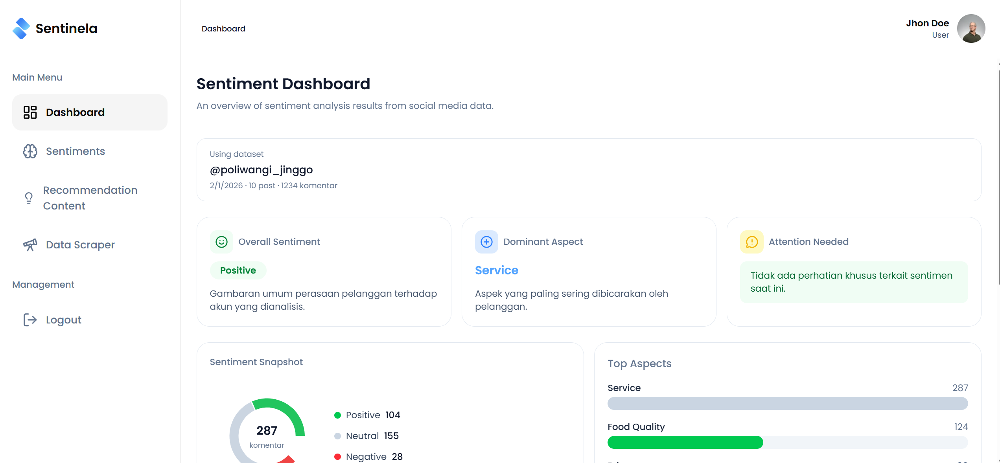
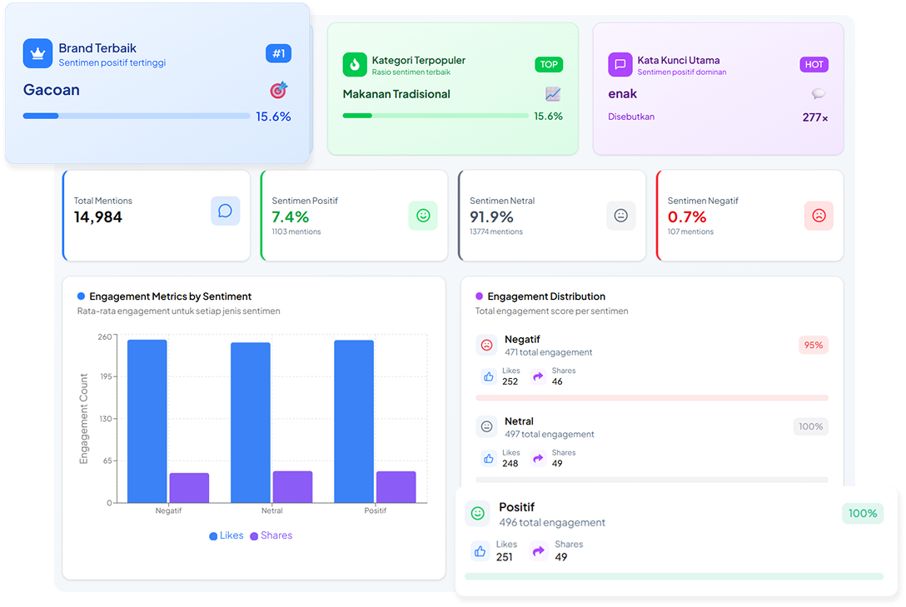

# Dashboard Sentiment Analysis

> **Penerapan Arsitektur Client Data Layer Menggunakan TanStack Query pada Dashboard Sentiment Analysis dengan metode Fountain**

A modern, responsive sentiment analysis dashboard built with React, TypeScript, and TanStack Query. This application provides comprehensive sentiment analysis, data scraping, and content recommendation features with a clean, modular architecture.

---

## **Author**

**Nasrul Fahmi Ulumuddin**  
NIM: 362258302204

---

## **Table of Contents**

- [Overview](#overview)
- [Features](#features)
- [Architecture](#architecture)
- [Tech Stack](#tech-stack)
- [Project Structure](#project-structure)
- [Getting Started](#getting-started)
- [Environment Variables](#environment-variables)
- [Available Scripts](#available-scripts)
- [Feature Generation](#feature-generation)
- [API Integration](#api-integration)
- [Docker Deployment](#docker-deployment)
- [Screenshots](#screenshots)
- [License](#license)

---

## **Overview**

This project implements a **Client Data Layer architecture** using **TanStack Query** (formerly React Query) following the **Fountain method** for managing server state in client-side applications. The dashboard provides:

- **Sentiment Analysis**: Analyze sentiment from scraped social media data
- **Data Scraping**: Scrape and manage data from various sources
- **Content Recommendation**: Get AI-powered content recommendations
- **Interactive Dashboard**: Visualize insights with charts and word clouds
- **Chatbot Integration**: AI-powered chatbot for data exploration

---

## **Features**

### **Core Features**

| Feature | Description |
|---------|-------------|
| **Dashboard** | Overview of sentiment analysis results with key metrics, charts, and insights |
| **Sentiment Analysis** | Detailed sentiment breakdown with aspect-based sentiment analysis (ABSA) |
| **Data Scraper** | Scrape data from social media platforms with scheduling support |
| **Recommendation** | AI-powered content strategy and hashtag recommendations |
| **Authentication** | Secure login/register with JWT token refresh mechanism |

### **Technical Features**

- **Client Data Layer**: TanStack Query for server state management
- **Auto Token Refresh**: Automatic JWT token refresh before expiration
- **Optimistic Updates**: Smooth UX with optimistic UI updates
- **Request Deduplication**: Prevent duplicate API calls
- **Smart Caching**: Intelligent query caching with stale-while-revalidate
- **Error Handling**: Centralized error handling with retry logic
- **Code Splitting**: Lazy loading for optimal bundle size
- **Responsive Design**: Mobile-first design with Tailwind CSS

---

## **Architecture**

### **Client Data Layer (Fountain Method)**

This project implements the **Fountain method** for Client Data Layer architecture using TanStack Query:

```text
┌─────────────────────────────────────────────────────────────┐
│                      UI Components                          │
│  (Pages, Components) - React components that consume data   │
└─────────────────────────────────────────────────────────────┘
                              │
                              ▼
┌─────────────────────────────────────────────────────────────┐
│                      Custom Hooks                            │
│  (useDashboardQuery, useSentimentQuery, etc.)                │
│  - Encapsulate query logic                                   │
│  - Handle query options (staleTime, gcTime, refetch)        │
└─────────────────────────────────────────────────────────────┘
                              │
                              ▼
┌─────────────────────────────────────────────────────────────┐
│                      Repository Layer                        │
│  (dashboard.repository, sentiment.repository, etc.)          │
│  - API request definitions                                   │
│  - Axios client integration                                  │
└─────────────────────────────────────────────────────────────┘
                              │
                              ▼
┌─────────────────────────────────────────────────────────────┐
│                      Axios Client                            │
│  - Request/Response interceptors                            │
│  - Auto token refresh                                        │
│  - Error normalization                                       │
└─────────────────────────────────────────────────────────────┘
                              │
                              ▼
┌─────────────────────────────────────────────────────────────┐
│                      Backend API                             │
│  (https://backend.sentinela.my.id)                           │
└─────────────────────────────────────────────────────────────┘
```

### **Query Key Factory Pattern**

Query keys are organized using a factory pattern for predictable cache management:

```typescript
// shared/query_keys.ts
export const scraperKeys = {
  all: ['scraper'] as const,
  list: () => [...scraperKeys.all, 'list'] as const,
  detail: (id: string) => [...scraperKeys.all, 'detail', id] as const,
};
```

### **Feature-Based Structure**

Each feature follows a consistent structure:

```text
features/
├── Dashboard/
│   ├── components/      # Feature-specific components
│   ├── hooks/           # Custom hooks for data fetching
│   ├── pages/           # Page components
│   ├── repository/      # API repository layer
│   └── types/           # TypeScript type definitions
```

---

## **Tech Stack**

### **Frontend Framework**
- **React 19** - UI library
- **TypeScript** - Type-safe JavaScript
- **Vite** - Build tool and dev server

### **State Management**
- **TanStack Query v5** - Server state management
- **Zustand** - Client state management (optional, per-feature)

### **Styling**
- **Tailwind CSS v4** - Utility-first CSS framework
- **shadcn/ui** - Reusable UI components
- **Radix UI** - Accessible component primitives
- **Framer Motion** - Animation library

### **Data Visualization**
- **Recharts** - Chart library
- **D3.js** - Word cloud and custom visualizations

### **HTTP & Forms**
- **Axios** - HTTP client with interceptors
- **React Hook Form** - Form handling
- **Zod** - Schema validation

### **Routing**
- **React Router v7** - Client-side routing

### **Development Tools**
- **ESLint** - Code linting
- **Bun** - Package manager and runtime

---

## **Project Structure**

```text
src/
├── assets/              # Static assets (images, icons)
├── components/          # Shared components
│   ├── dashboard/       # Dashboard-specific components
│   └── ui/              # shadcn/ui components
├── context/             # React context providers
├── features/            # Feature-based modules
│   ├── Dashboard/       # Dashboard feature
│   ├── Sentiment/       # Sentiment analysis feature
│   ├── Scraper/         # Data scraping feature
│   ├── Recomendation/   # Content recommendation feature
│   ├── Home/            # Home page feature
│   ├── Login/           # Authentication feature
│   └── Register/        # Registration feature
├── helper/              # Utility helper functions
├── hooks/               # Global custom hooks
├── layout/              # Layout components
├── lib/                 # Core libraries
│   ├── axios.ts         # Axios instance with interceptors
│   ├── query-client.ts  # TanStack Query client config
│   ├── env.ts           # Environment variables
│   └── ...              # Other utilities
├── provider/            # Context providers
├── routes/              # Routing configuration
├── shared/              # Shared constants and configs
├── store/               # Zustand stores
└── type/                # Global TypeScript types
```

---

## **Getting Started**

### **Prerequisites**

- **Node.js** >= 18.x or **Bun** >= 1.x
- **npm**, **yarn**, or **bun** package manager
- **PostgreSQL** >= 15.x (with `uuid-ossp` and `pgvector` extensions)

### **Installation**

1. **Clone the repository**
   ```bash
   git clone <repository-url>
   cd Dashboard-Sentiment-Analysis
   ```

2. **Install dependencies**
   ```bash
   bun install
   # or
   npm install
   ```

3. **Set up the database**
   Import the provided database schema (`db.sql`) into your PostgreSQL database:
   ```bash
   psql -U your_username -d your_database_name -f db.sql
   ```
   *Note: Make sure your PostgreSQL server has the `uuid-ossp` and `pgvector` (vector) extensions enabled before importing.*

4. **Set up environment variables**
   ```bash
   cp .env.example .env
   ```
   
   Edit `.env` with your configuration:
   ```env
   VITE_API_BASE_URL=https://your-api-url.com
   VITE_NODE_ENV=development
   ```

5. **Start development server**
   ```bash
   bun run dev
   # or
   npm run dev
   ```

6. **Open in browser**
   ```text
   http://localhost:5173
   ```

---

## **Environment Variables**

| Variable | Description | Example |
|----------|-------------|---------|
| `VITE_API_BASE_URL` | Backend API base URL | `https://backend.sentinela.my.id` |
| `VITE_NODE_ENV` | Environment mode | `development` or `production` |

---

## **Available Scripts**

| Script | Description |
|--------|-------------|
| `bun run dev` | Start development server |
| `bun run build` | Build for production |
| `bun run preview` | Preview production build |
| `bun run lint` | Run ESLint |
| `bun run new:feature <name>` | Generate new feature scaffold |
| `bun run mock` | Start mock API server |

---

## **Feature Generation**

This project includes a CLI tool to scaffold new features with the proper structure.

### **Basic Feature**

```bash
bun run new:feature <feature-name>
```

Creates:
```text
src/features/<FeatureName>/
├── components/    # React components
├── hooks/         # Custom hooks
├── pages/         # Page components
├── repository/    # API repository
└── types/         # TypeScript types
```

### **Feature with Zustand Store**

```bash
bun run new:feature <feature-name> --store
```

Additionally creates:
```text
src/features/<FeatureName>/
└── store/         # Zustand store files
```

---

## **API Integration**

### **Axios Client Configuration**

The project uses a centralized Axios client with:

- **Request Interceptor**: Auto-attach Bearer token, refresh expired tokens
- **Response Interceptor**: Handle 401 errors, auto-refresh tokens
- **Error Normalization**: Consistent error format across the app

### **Token Refresh Flow**

```text
1. Request sent with access token
2. If token expired → refresh token automatically
3. If refresh succeeds → retry original request
4. If refresh fails → logout user
```

### **Query Client Configuration**

```typescript
// Default stale time: 0 (always refetch)
// Default gc time: 5 minutes
// Retry: 2 times for server errors, 0 for client errors
```

---

## **Docker Deployment**

### **Build and Run**

```bash
# Build image
docker build -t dashboard-sentiment .

# Run container
docker run -p 80:80 dashboard-sentiment
```

### **Docker Compose**

```bash
docker-compose up --build
```

The application will be available at `http://localhost`

### **Production Configuration**

- Multi-stage Dockerfile for optimized builds
- Nginx server with gzip compression
- Security headers enabled
- Client-side routing support
- Health check endpoint

---

## **Screenshots**

### **Landing Page**


### **Dashboard Overview**


---

## **Key Implementation Details**

### **Authentication Flow**

1. User logs in → receive `access_token` and `refresh_token`
2. Tokens stored in `localStorage`
3. Every request includes `Authorization: Bearer <token>` header
4. Before token expires, auto-refresh triggered
5. On 401 error, attempt token refresh and retry

### **Data Fetching Pattern**

```typescript
// hooks/useDashboardQuery.ts
export function useDashboardQuery(datasetId: string) {
  return useQuery({
    queryKey: dashboardKeys.detail(datasetId),
    queryFn: () => dashboardRepository.getDashboard(datasetId),
    staleTime: 5 * 60 * 1000, // 5 minutes
    enabled: !!datasetId,
  });
}
```

### **Mutation Pattern**

```typescript
// hooks/useLoginMutation.ts
export function useLoginMutation() {
  const queryClient = useQueryClient();
  
  return useMutation({
    mutationFn: loginRepository.login,
    onSuccess: (data) => {
      localStorage.setItem('access_token', data.accessToken);
      queryClient.invalidateQueries({ queryKey: ['user'] });
    },
  });
}
```

---

## **Contributing**

This is a research project. For questions or collaboration, please contact the author.

---

## **License**

This project is developed for academic purposes as part of a final project (Tugas Akhir).

---

## **Contact**

**Nasrul Fahmi Ulumuddin**  
NIM: 362258302204

---

*Built with ❤️ using React, TypeScript, and TanStack Query*
